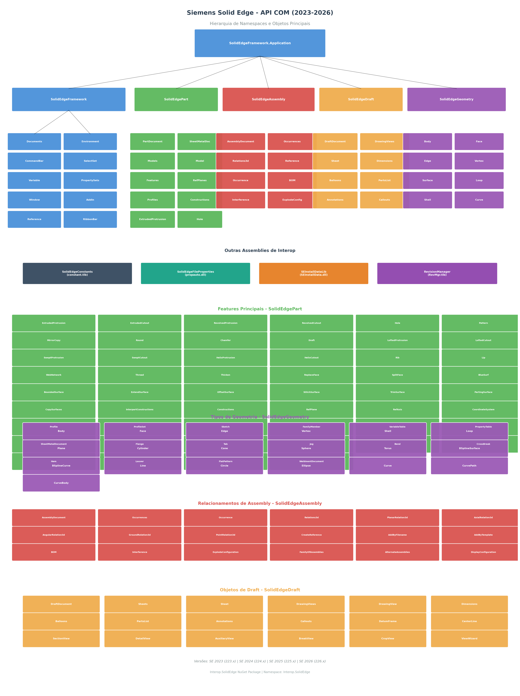

# Siemens Solid Edge - Catálogo Completo da API COM (2023-2026)

**TL;DR:** Este documento mapeia **todas as bibliotecas de Interop COM** do Siemens Solid Edge para automação em C#: **SolidEdgeFramework** (controle da aplicação, UI, variáveis), **SolidEdgePart** (features, perfis, superfícies, eletrodos), **SolidEdgeAssembly** (montagens, relacionamentos, BOM), **SolidEdgeDraft** (desenhos 2D, vistas, dimensões), **SolidEdgeGeometry** (topologia e geometria 3D), **SolidEdgeConstants** (enums), **SolidEdgeFileProperties** (propriedades de arquivo), **SEInstallDataLib** e **RevisionManager** — com objetos, métodos, parâmetros e enums documentados para uso no projeto **AutoEDM**.



---

## 1. Visão Geral das Assemblies de Interop

O pacote NuGet `Interop.SolidEdge` (disponível em [.NET Framework 4.7.2+](https://nuget.org/packages/Interop.SolidEdge)) contém **todas as definições de API** em uma única assembly, gerada a partir das type libraries originais do Solid Edge  [(Github)](https://github.com/SolidEdgeCommunity/Interop.SolidEdge) . Cada namespace corresponde a uma type library (.tlb) ou DLL COM distinta, conforme a tabela abaixo.

| Namespace | Type Library / DLL | Descrição | ProgID Principal |
|---|---|---|---|
| `SolidEdgeFramework` | `framewrk.tlb` | Núcleo da aplicação, documentos, UI, variáveis, eventos | `SolidEdge.Application` |
| `SolidEdgePart` | `Part.tlb` | Documentos de peça, features, perfis, superfícies, chapa metálica | `SolidEdge.PartDocument` |
| `SolidEdgeAssembly` | `assembly.tlb` | Montagens, ocorrências, relacionamentos 3D, BOM | `SolidEdge.AssemblyDocument` |
| `SolidEdgeDraft` | `draft.tlb` | Desenhos 2D, vistas, dimensões, anotações | `SolidEdge.DraftDocument` |
| `SolidEdgeGeometry` | `geometry.tlb` | Topologia e geometria 3D (faces, arestas, corpos) | — (sub-objetos) |
| `SolidEdgeConstants` | `constant.tlb` | Constantes e enums usados por todos os namespaces | — |
| `SolidEdgeFrameworkSupport` | `fwksupp.tlb` | Suporte a janelas, barras de comando, seleção | — |
| `SolidEdgeFileProperties` | `propauto.dll` | Propriedades de arquivo sem necessidade do SE aberto | `SolidEdgeFileProperties.PropertySets` |
| `SEInstallDataLib` | `SEInstallData.dll` | Dados de instalação do Solid Edge | `SEInstallDataLib.SEInstallData` |
| `RevisionManager` | `RevMgr.tlb` | Gerenciamento de revisões e estruturas | — |

A versão do pacote NuGet segue o padrão: **Major** = versão do Solid Edge (223 para SE 2023, 224 para SE 2024, etc.), **Minor** = service pack  [(Github)](https://github.com/SolidEdgeCommunity/Interop.SolidEdge) . Para o projeto AutoEDM, que utiliza **SE 2023 (223.00.13.05)** em ambiente **x64 STA** com late binding (`dynamic`) via `InvokeMember`, este catálogo serve como referência para decidir quais objetos e métodos usar em cada ferramenta [^SKILL^].

---

## 2. SolidEdgeFramework — Núcleo da Aplicação

O namespace `SolidEdgeFramework` é o ponto de entrada de toda automação. O objeto `Application` é a raiz da hierarquia, a partir do qual se acessam documentos, ambientes, variáveis, a interface gráfica e os mecanismos de eventos  [(Siemens Software Support)](https://support.industrysoftware.automation.siemens.com/trainings/se/107/api/SolidEdgeFramework_P.html) .

### 2.1 Application — Objeto Raiz

O objeto `Application` representa a instância em execução do Solid Edge. Em C#, a conexão padrão usa `Marshal.GetActiveObject("SolidEdge.Application")` para conectar a uma instância já em execução, ou `Activator.CreateInstance(Type.GetTypeFromProgID("SolidEdge.Application"))` para iniciar uma nova  [(Siemens Software Support)](https://support.industrysoftware.automation.siemens.com/trainings/se/106/api/CreatingDocuments.html) .

| Propriedade / Método | Tipo | Descrição |
|---|---|---|
| `ActiveDocument` | `SolidEdgeDocument` | Retorna o documento atualmente ativo |
| `ActiveEnvironment` | `string` | Nome do ambiente ativo ("Part", "Assembly", "Draft", etc.) |
| `ActiveSelectSet` | `SelectSet` | Conjunto de seleção ativo no documento corrente |
| `Documents` | `Documents` | Coleção de todos os documentos abertos |
| `Environments` | `Environments` | Coleção de ambientes disponíveis |
| `Window` | `Window` | Janela principal da aplicação |
| `CommandBars` | `CommandBars` | Coleção de barras de comando |
| `Visible` | `bool` | Controla a visibilidade da janela do Solid Edge |
| `GetDefaultTemplatePath(DocumentTypeConstants)` | `string` | Retorna o caminho do template padrão para um tipo de documento |
| `GetActiveEnvironment()` | `Environment` | Retorna o ambiente ativo como objeto |
| `Quit()` | `void` | Encerra a aplicação |
| `ScreenUpdating` | `bool` | Ativa/desativa atualização da tela (útil para batch) |
| `StatusBar` | `string` | Texto exibido na barra de status |
| `UserName` | `string` | Nome do usuário atual |
| `ProcessID` | `int` | ID do processo do Solid Edge |
| `Interactive` | `bool` | Define se a aplicação pode ser usada interativamente |

A propriedade `Documents` é a principal porta de entrada para trabalhar com arquivos. Ela expõe os métodos `Add(ProgID)`, `Open(filename)`, `Close()` e a propriedade `Count` para iterar pelos documentos abertos  [(Siemens Software Support)](https://support.industrysoftware.automation.siemens.com/trainings/se/106/api/SolidEdgeFramework~Application_members.html) . O método `GetDefaultTemplatePath` recebe um valor do enum `DocumentTypeConstants` (ex: `igPartDocument = 1`, `igAssemblyDocument = 3`) e retorna o caminho completo do template, sendo essencial para criar documentos via `AddByTemplate` em contexto de montagem  [(Siemens Software Support)](https://support.industrysoftware.automation.siemens.com/trainings/se/107/api/SolidEdgeFramework~DocumentTypeConstants.html) [^SKILL^].

### 2.2 Documents e SolidEdgeDocument

A coleção `Documents` gerencia todos os documentos abertos na sessão do Solid Edge. Cada documento é representado por `SolidEdgeDocument`, que serve como classe base para os tipos especializados (`PartDocument`, `AssemblyDocument`, `DraftDocument`, etc.).

| Propriedade / Método | Tipo | Descrição |
|---|---|---|
| `Add(string ProgID)` | `SolidEdgeDocument` | Cria novo documento pelo ProgID |
| `Open(string filename)` | `SolidEdgeDocument` | Abre documento existente |
| `Close()` | `void` | Fecha todos os documentos |
| `Count` | `int` | Número de documentos abertos |
| `Item(int index)` | `SolidEdgeDocument` | Acessa documento por índice (1-based) |

O `SolidEdgeDocument` expõe propriedades comuns a todos os tipos de documento, como `Name`, `FullName`, `Path`, `Type` (retorna `DocumentTypeConstants`), `SelectSet`, `HighlightSets`, `PropertySets`, `SummaryInfo`, `AttributeSets`, `Windows`, `UnitsOfMeasure` e `Variables`  [(Siemens Software Support)](https://support.industrysoftware.automation.siemens.com/trainings/se/107/api/SolidEdgeFramework_P.html) . A propriedade `Type` é particularmente útil para discriminar o tipo de documento em código genérico: compare com `DocumentTypeConstants.igPartDocument` (1), `igAssemblyDocument` (3), `igDraftDocument` (2), `igSheetMetalDocument` (4), `igWeldmentDocument` (6), `igSyncPartDocument` (8) ou `igSyncAssemblyDocument` (10)  [(Siemens Software Support)](https://support.industrysoftware.automation.siemens.com/trainings/se/107/api/SolidEdgeFramework~DocumentTypeConstants.html) .

### 2.3 Environment, Window e CommandBars

O `Environment` define o conjunto de comandos, menus e aceleradores disponíveis para uma janela específica. Cada tipo de documento (Part, Assembly, Draft) possui seu próprio ambiente. A propriedade `Application.Environments` retorna a coleção de todos os ambientes, e `GetActiveEnvironment()` retorna o ambiente corrente  [(Siemens Software Support)](https://support.industrysoftware.automation.siemens.com/trainings/se/107/api/SolidEdgeFramework_P.html) .

| Classe | Descrição |
|---|---|
| `Environment` | Menus, aceleradores e comandos de um ambiente específico |
| `Environments` | Coleção de todos os ambientes disponíveis |
| `Window` | Janela de documento do Solid Edge |
| `Windows` | Coleção de janelas abertas |
| `CommandBar` | Representa menus, toolbars e pop-ups |
| `CommandBars` | Coleção de barras de comando de um ambiente |
| `CommandBarButton` | Botão em toolbar ou menu |
| `CommandBarPopup` | Menu pop-up em toolbar |
| `RibbonBar` | Barra de ribbon (interface moderna) |
| `RibbonBarTab` | Aba da ribbon |
| `RibbonBarGroup` | Grupo de controles na ribbon |
| `RibbonBarControl` | Controle individual na ribbon |

O objeto `Window` expõe propriedades como `Caption`, `Height`, `Width`, `Left`, `Top`, `WindowState` e o método `Activate()` para trazer a janela para frente. No contexto do AutoEDM, esses objetos são úteis para construir add-ins que adicionam botões personalizados às toolbars e ribbons do Solid Edge  [(Source)](http://www.sucarga.cl/grafica/manual%20programacion%20solid%20edge%20v10(1).pdf) .

### 2.4 Variable, PropertySets e SelectSet

O sistema de variáveis do Solid Edge permite associar nomes a valores numéricos, criando fórmulas e vinculações entre dimensões. O `VariableTable` (acessível via `document.Variables`) é o repositório central dessas variáveis  [(Solid DNA)](https://www.soliddna.com/SEHelp/ST5/EN/a_h/equat1a.htm) .

| Classe | Descrição |
|---|---|
| `variable` | Associa um nome a um valor numérico |
| `VariableList` | Lista de variáveis retornada por uma query |
| `PropertySets` | Coleção de conjuntos de propriedades do documento |
| `Properties` | Coleção de propriedades individuais |
| `Property` | Propriedade individual (nome/valor) |
| `SelectSet` | Agrupamento temporário de objetos selecionados |
| `HighlightSet` | Conjunto de objetos em destaque |
| `HighlightSets` | Coleção de HighlightSets |

O `SelectSet` é fundamental para operações em lote. Seus métodos principais são `Add(object)`, `Remove(object)`, `RemoveAll()`, `Copy()`, `Cut()` e `Delete()`  [(Siemens Software Support)](https://support.industrysoftware.automation.siemens.com/trainings/se/106/api/SolidEdgeFramework~SelectSet~Add.html) . A partir do SE V17 build 28, o método `Add()` também aceita um objeto `HighlightSet` completo, o que é significativamente mais rápido para adicionar grandes coleções de objetos, pois evita redesenhar a tela após cada item  [(Siemens Software Support)](https://support.industrysoftware.automation.siemens.com/trainings/se/106/api/SolidEdgeFramework~SelectSet~Add.html) .

### 2.5 AddIn, Command, Mouse e Eventos

O mecanismo de add-ins do Solid Edge permite estender a funcionalidade da aplicação através de DLLs COM. A interface `ISolidEdgeAddIn` é o contrato que todo add-in deve implementar para ser reconhecido pelo Solid Edge durante a inicialização  [(Siemens Software Support)](https://support.industrysoftware.automation.siemens.com/trainings/se/107/api/SolidEdgeFramework_P.html) .

| Classe / Interface | Descrição |
|---|---|
| `ISolidEdgeAddIn` | Interface que add-ins devem implementar |
| `AddIn` | Representa um comando adicionado via add-in |
| `AddIns` | Coleção de add-ins registrados |
| `Command` | Captura entrada do usuário para processar eventos |
| `Mouse` | Captura eventos de mouse |
| `CommandBarButtonEvents` | Eventos de botões da toolbar |
| `ApplicationEvents` | Eventos da aplicação (OnOpen, OnClose, etc.) |
| `DocumentEvents` | Eventos de documentos |
| `ModelRecomputeEvents` | Eventos de recomputação de modelo |
| `AssemblyChangeEvents` | Eventos de alteração em montagens |
| `DrawingViewEvents` | Eventos de vistas de desenho |
| `FeatureLibraryEvents` | Eventos de biblioteca de features |
| `FileUIEvents` | Eventos de interface de arquivo |

A interface `ISolidEdgeAddIn` define métodos como `OnConnectToEnvironment`, `OnDisconnect`, e propriedades para registro de comandos via `SetAddInInfo`. O objeto `Command` permite criar comandos personalizados que respondem a cliques do mouse e entrada de teclado, enquanto o objeto `Mouse` expõe eventos como `MouseDown`, `MouseMove` e `MouseUp` para interação direta na viewport  [(Source)](http://www.sucarga.cl/grafica/manual%20programacion%20solid%20edge%20v10(1).pdf) .

### 2.6 Reference, AttributeSets, Sensors e Outros

| Classe | Descrição |
|---|---|
| `Reference` | Referência a um objeto de outro documento (usado em assemblies) |
| `AttributeSet` | Conjunto de atributos definidos pelo usuário |
| `AttributeSets` | Coleção de AttributeSets |
| `Attribute` | Atributo individual (nome, valor, tipo) |
| `AttributeQuery` | Consulta por atributos por nome |
| `Sensor` | Sensor em documento (distância, volume, etc.) |
| `Sensors` | Coleção de sensores |
| `SectionView` | Vista de seção em Part/Assembly |
| `SectionViews` | Coleção de SectionViews |
| `RoutingSlip` | Distribuição de documentos por e-mail |
| `UnitOfMeasure` | Unidade de medida e precisão |
| `UnitsOfMeasure` | Coleção de unidades de medida |
| `SummaryInfo` | Informações resumidas do documento |
| `FaceStyle` | Estilo de face (cor, material) |
| `FaceStyles` | Coleção de FaceStyles |
| `TextStyle` | Estilo de texto |
| `TextStyles` | Coleção de TextStyles |
| `Layer` | Camada em documento Draft |
| `Layers` | Coleção de Layers |
| `QueryObjects` | Coleção de objetos retornados por uma query |

O objeto `Reference` é **crítico para montagens**: ele armazena o caminho (path) através da hierarquia de ocorrências até a geometria real de uma peça. O método `AssemblyDocument.CreateReference(Occurrence, Entity)` cria uma referência a partir de uma ocorrência e uma entidade geométrica (Face, Edge, RefPlane)  [(Siemens Software Support)](https://support.industrysoftware.automation.siemens.com/trainings/se/106/api/WorkingWithReferences.html) . Esse mecanismo permite que relacionamentos 3D, medições e operações de estilo sejam aplicados à geometria de peças aninhadas em sub-montagens de qualquer profundidade.

---

## 3. SolidEdgePart — Documentos de Peça e Features

O namespace `SolidEdgePart` contém todos os objetos relacionados a modelagem de peças, chapa metálica e soldagem. É o namespace mais extenso da API, com dezenas de tipos de features, elementos construtivos e objetos de perfil  [(Siemens Software Support)](https://support.industrysoftware.automation.siemens.com/trainings/se/107/api/SolidEdgePart_P.html) .

### 3.1 PartDocument, SheetMetalDocument e WeldmentDocument

| Classe | ProgID | Descrição |
|---|---|---|
| `PartDocument` | `SolidEdge.PartDocument` | Documento de peça sólida (.par) |
| `SheetMetalDocument` | `SolidEdge.SheetMetalDocument` | Documento de chapa metálica (.psm) |
| `WeldmentDocument` | `SolidEdge.WeldmentDocument` | Documento de soldagem (.pwd) |

Todas essas classes derivam de `SolidEdgeDocument` e compartilham a estrutura hierárquica: `Models` → `Model` → `Features`. Além disso, expõem coleções específicas como `RefPlanes`, `ProfileSets`, `Constructions`, `CoordinateSystems`, `FamilyMembers`, `PropertyTableDefinitions`, `SelectSet`, `Sketches`, `AttributeSets` e `Windows`  [(narod.ru)](https://rct2.narod.ru/solidedge/ProgGuide.pdf) .

| Propriedade / Método | Tipo | Descrição |
|---|---|---|
| `Models` | `Models` | Coleção de modelos do documento |
| `RefPlanes` | `RefPlanes` | Planos de referência |
| `ProfileSets` | `ProfileSets` | Conjuntos de perfis |
| `Constructions` | `Constructions` | Elementos construtivos (superfícies, curvas) |
| `Features` | `Features` | Coleção de todas as features (via Model) |
| `CoordinateSystems` | `CoordinateSystems` | Sistemas de coordenadas definidos pelo usuário |
| `FamilyMembers` | `FamilyMembers` | Membros de família de peças |
| `Sketches` | `Sketchs` | Esboços no documento |
| `Sheets` | (SheetMetal only) | Planilhas de chapa |
| `FlatPatternModels` | (SheetMetal only) | Modelos de plano de chapa |

### 3.2 Models, Model e Features

O objeto `Model` representa uma coleção de features que definem uma única peça sólida. O `Models` é a coleção que contém todos os modelos do documento (tipicamente apenas um para peças simples, múltiplos para multi-body)  [(narod.ru)](https://rct2.narod.ru/solidedge/ProgGuide.pdf) .

| Classe | Descrição |
|---|---|
| `Models` | Coleção de Model objects |
| `Model` | Coleção de features que definem uma peça |
| `Features` | Coleção genérica de Feature objects |
| `EdgebarFeatures` | Features exibidas na EdgeBar |

O `Model` é o gateway para acessar todas as features de uma peça. Suas propriedades mais importantes são:

| Propriedade | Tipo | Descrição |
|---|---|---|
| `Body` | `Body` (SolidEdgeGeometry) | Corpo sólido do modelo — acesso à topologia |
| `ExtrudedProtrusions` | `ExtrudedProtrusions` | Coleção de protrusões extrudadas |
| `ExtrudedCutouts` | `ExtrudedCutouts` | Coleção de recortes extrudados |
| `RevolvedProtrusions` | `RevolvedProtrusions` | Protrusões revolucionadas |
| `RevolvedCutouts` | `RevolvedCutouts` | Recortes revolucionados |
| `Holes` | `Holes` | Furos |
| `Rounds` | `Rounds` | Arredondamentos |
| `Chamfers` | `Chamfers` | Chanfros |
| `Patterns` | `Patterns` | Padrões (retangular/circular) |
| `MirrorCopies` | `MirrorCopies` | Cópias espelhadas |
| `Threads` | `Threads` | Roscos |
| `Drafts` | `Drafts` | Inclinações de parede |
| `Ribs` | `Ribs` | Nervuras |
| `Lips` | `Lips` | Rebaixos |
| `Thins` | `Thins` | Regiões finas |
| `Thicken` | `Thickens` | Engrossamentos |
| `HelixProtrusions` | `HelixProtrusions` | Protrusões helicoidais |
| `HelixCutouts` | `HelixCutouts` | Recortes helicoidais |
| `LoftedProtrusions` | `LoftedProtrusions` | Protrusões lofted |
| `LoftedCutouts` | `LoftedCutouts` | Recortes lofted |
| `SweptProtrusions` | `SweptProtrusions` | Protrusões swept |
| `SweptCutouts` | `SweptCutouts` | Recortes swept |
| `WebNetworks` | `WebNetworks` | Redes de web |
| `BlueSurfs` | `BlueSurfs` | Superfícies BlueSurf |

Cada uma dessas coleções é **1-based** (o primeiro elemento é `Item(1)`), e possui a propriedade `Count` para iteração [^SKILL^]. A propriedade `Body` é particularmente importante pois fornece acesso à topologia Parasolid do modelo — faces, arestas e vértices — através do namespace `SolidEdgeGeometry`  [(Siemens Software Support)](https://support.industrysoftware.automation.siemens.com/trainings/se/107/api/SolidEdgeGeometry_P.html) .

### 3.3 Features de Protrusão e Recorte

As features de protrusão adicionam material ao modelo, enquanto as de recorte removem material. Todas são criadas a partir de perfis desenhados em planos de referência.

| Classe | Tipo | Método de Criação (Model) | Parâmetros Principais |
|---|---|---|---|
| `ExtrudedProtrusion` | Protrusão | `AddFiniteExtrudedProtrusion()` | `NumberOfProfiles`, `ProfileArray[]`, `ProfilePlaneSide`, `ExtrusionDistance` |
| `ExtrudedCutout` | Recorte | `AddFiniteExtrudedCutout()` | `NumberOfProfiles`, `ProfileArray[]`, `ProfilePlaneSide`, `CutoutDistance` |
| `RevolvedProtrusion` | Protrusão | `AddFiniteRevolvedProtrusion()` | `Profile`, `RefAxis`, `AngleOfRevolution` |
| `RevolvedCutout` | Recorte | `AddFiniteRevolvedCutout()` | `Profile`, `RefAxis`, `AngleOfRevolution` |
| `LoftedProtrusion` | Protrusão | `AddLoftedProtrusion()` | Array de `Profile`s ou `CrossSection`s |
| `LoftedCutout` | Recorte | `AddLoftedCutout()` | Array de `Profile`s ou `CrossSection`s |
| `SweptProtrusion` | Protrusão | `AddSweptProtrusion()` | `Profile`, `Path` |
| `SweptCutout` | Recorte | `AddSweptCutout()` | `Profile`, `Path` |
| `HelixProtrusion` | Protrusão | `AddHelixProtrusion()` | `Profile`, `RefAxis`, `Pitch`, `Turns` |
| `HelixCutout` | Recorte | `AddHelixCutout()` | `Profile`, `RefAxis`, `Pitch`, `Turns` |
| `NormalToFaceProtrusion` | Protrusão | `AddNormalToFaceProtrusion()` | `Profile`, `Face` |
| `NormalToFaceCutout` | Recorte | `AddNormalToFaceCutout()` | `Profile`, `Face` |

A criação de uma feature extrudada (protrusion ou cutout) segue o padrão: (1) criar um `ProfileSet`, (2) adicionar um `Profile` em um `RefPlane`, (3) desenhar geometria 2D no perfil, (4) chamar o método `Add` apropriado no `Model` passando o array de perfis e parâmetros de extensão. A constante `ProfilePlaneSide` usa valores como `igRight` (lado positivo da normal do plano) ou `igLeft` (lado negativo)  [(narod.ru)](https://rct2.narod.ru/solidedge/ProgGuide.pdf) .

### 3.4 Features de Tratamento (Treatment Features)

Features que modificam faces ou arestas existentes sem necessidade de perfil.

| Classe | Descrição | Acesso via Model |
|---|---|---|
| `Hole` | Furo usando padrão circular | `Holes.AddByThroughAll()` |
| `Round` | Arredondamento de arestas | `Rounds.Add()` |
| `Chamfer` | Chanfro de arestas | `Chamfers.Add()` |
| `Draft` | Inclinação de faces | `Drafts.Add()` |
| `Thread` | Rosco em furos/eixos | `Threads.Add()` |
| `Pattern` | Padrão retangular/circular de features | `Patterns.Add()` |
| `MirrorCopy` | Cópia espelhada de features | `MirrorCopies.Add()` |
| `Thicken` | Engrossamento de superfícies | `Thickens.Add()` |
| `Rib` | Nervura | `Ribs.Add()` |
| `Lip` | Rebaixo/labio | `Lips.Add()` |
| `Thin` | Região fina | `Thins.Add()` |
| `WebNetwork` | Rede de web | `WebNetworks.Add()` |
| `ReplaceFace` | Substituição de face | `ReplaceFaces.Add()` |
| `SplitFace` | Divisão de face | `SplitFaces.Add()` |
| `MountingBoss` | Boss de montagem | `MountingBossCollection.Add()` |

O `Hole` é uma feature especial que usa um perfil circular e cria um recorte que atravessa o modelo. Seus métodos de criação incluem `AddByThroughAll`, `AddFinite` e `AddFromTo`, aceitando parâmetros como diâmetro, posição e condição de extremidade  [(Siemens Software Support)](https://support.industrysoftware.automation.siemens.com/trainings/se/107/api/SolidEdgePart_P.html) . O `Round` e `Chamfer` operam sobre coleções de arestas (`Edges`), aplicando raio ou ângulo de chanfro respectivamente.

### 3.5 Superfícies e Construções

O namespace `SolidEdgePart` também contém objetos para modelagem de superfícies e elementos construtivos usados como referência para outras features.

| Classe | Descrição | Coleção |
|---|---|---|
| `BlueSurf` | Superfície BlueSurf (lofted por seções e guias) | `BlueSurfs` |
| `BoundedSurface` | Superfície delimitada por bordas | `BoundedSurfaces` |
| `ExtendSurface` | Extensão de superfície existente | `ExtendSurfaces` |
| `OffsetSurface` | Superfície offset | `OffsetSurfaces` |
| `StitchSurface` | Costura de superfícies | `StitchSurfaces` |
| `TrimSurface` | Corte de superfície | `TrimSurfaces` |
| `PartingSurface` | Superfície de separação (moldes) | `PartingSurfaces` |
| `ExtrudedSurface` | Superfície extrudada (construção) | `ExtrudedSurfaces` |
| `RevolvedSurface` | Superfície revolucionada (construção) | `RevolvedSurfaces` |
| `LoftedSurface` | Superfície lofted (construção) | `LoftedSurfaces` |
| `SweptSurface` | Superfície swept (construção) | `SweptSurfaces` |
| `RuledSurface` | Superfície ruled | `RuledSurfaces` |
| `MidSurface` | Superfície média | `MidSurfaces` |
| `CopySurface` | Cópia de superfície | `CopySurfaces` |
| `IntersectionCurve` | Curva de interseção | `IntersectionCurves` |
| `ProjectCurve` | Curva projetada | `ProjectCurves` |
| `CrossCurve` | Curva de cruzamento | `CrossCurves` |
| `ContourCurve` | Curva de contorno | `ContourCurves` |
| `KeyPointCurve` | Curva por pontos-chave | `KeyPointCurves` |
| `SplitCurve` | Curva dividida | `SplitCurves` |
| `IsoclineCurve` | Curva isoclina | `IsoclineCurves` |
| `ConstructionModel` | Modelo construtivo | `ConstructionModels` |
| `Constructions` | Coleção de elementos construtivos | — |

O objeto `CopySurfaces` é **crítico para o fluxo de eletrodos do AutoEDM**. O método `CopySurfaces.Add(NumberOfFaces, FaceArray, [opt]InternalBoundary, [opt]ExternalBoundary)` cria uma cópia de superfícies de uma peça para outra em contexto de montagem. O parâmetro `FaceArray` deve ser um array tipado `Face[]` (que se marshala como `SAFEARRAY(IDispatch)`); `object[]` vira `SAFEARRAY(VARIANT)` e é rejeitado [^SKILL^]. Esse mecanismo é a base do Inter-Part Copy associativo usado para copiar faces de queima da cavidade para o eletrodo.

### 3.6 InterpartConstructions e CopiedParts

| Classe | Descrição |
|---|---|
| `InterpartConstruction` | Elemento construtivo de cópia inter-parte |
| `InterpartConstructions` | Coleção de InterpartConstruction |
| `CopiedPart` | Peça copiada de outro documento |
| `CopiedParts` | Coleção de CopiedPart |
| `CopyConstruction` | Construção por cópia |
| `CopyConstructions` | Coleção de CopyConstruction |
| `PatternPart` | Padrão de peça |
| `PatternParts` | Coleção de PatternPart |

O `InterpartConstructions` é uma alternativa ao `CopySurfaces` para criar referências associativas entre peças. Enquanto `CopySurfaces` copia geometria de superfície, `InterpartConstructions` pode criar referências a features inteiras. A hipótese atual no AutoEDM é que, se `CopySurfaces.Add` continuar falhando com `E_FAIL`, o próximo passo é investigar `InterpartConstructions.Add` / `CreateTopologyReference` — assinaturas a extrair do dump da typelib [^SKILL^].

### 3.7 RefPlane, RefAxis e CoordinateSystem

| Classe | Descrição | Métodos de Criação |
|---|---|---|
| `RefPlane` | Plano de referência para perfis | `RefPlanes.AddParallelByDistance()`, `AddAngularByAngle()`, `AddNormalToCurve()` |
| `RefPlanes` | Coleção de planos de referência | — |
| `RefAxis` | Eixo de referência para features revolucionadas | `RefAxes.AddByRotation()`, `AddBy2Points()` |
| `RefAxes` | Coleção de eixos de referência | — |
| `CoordinateSystem` | Sistema de coordenadas definido pelo usuário | `CoordinateSystems.Add()` |
| `CoordinateSystems` | Coleção de sistemas de coordenadas | — |

Os planos de referência são fundamentais para todo o processo de modelagem. Os três planos base (xy, yz, xz) sempre existem e são acessíveis via `RefPlanes.Item(1)`, `Item(2)` e `Item(3)`. Novos planos podem ser criados paralelos a um plano existente (`AddParallelByDistance`), por ângulo (`AddAngularByAngle`), normal a uma curva (`AddNormalToCurve`), ou por três pontos (`AddBy3Points`)  [(narod.ru)](https://rct2.narod.ru/solidedge/ProgGuide.pdf) .

### 3.8 Profile, ProfileSet e Sketch

| Classe | Descrição |
|---|---|
| `Profile` | Um ou mais elementos geométricos conectados que não se interceptam |
| `Profiles` | Coleção de Profile objects |
| `ProfileSet` | Proprietário de uma coleção Profiles |
| `ProfileSets` | Coleção de ProfileSet objects |
| `Sketch` | Esboço em um plano de referência |
| `Sketchs` | Coleção de Sketch objects |
| `ComponentSketch` | Esboço de componente |
| `ComponentSketches` | Coleção de ComponentSketch |

O workflow para criar um perfil é: (1) `ProfileSet = document.ProfileSets.Add()`, (2) `Profile = ProfileSet.Profiles.Add(RefPlane)`, (3) desenhar geometria 2D via `Profile.Lines2d`, `Profile.Circles2d`, `Profile.Arcs2d`, etc., (4) adicionar relações 2D via `Profile.Relations2d`, (5) fechar o perfil com `Profile.End()`  [(narod.ru)](https://rct2.narod.ru/solidedge/ProgGuide.pdf) . O perfil então é passado como parâmetro para os métodos de criação de features no `Model`.

### 3.9 Features de Chapa Metálica (Sheet Metal)

| Classe | Descrição |
|---|---|
| `SheetMetalDocument` | Documento de chapa metálica (.psm) |
| `Flange` | Rebatimento de borda |
| `Flanges` | Coleção de Flange |
| `Tab` | Aba |
| `Tabs` | Coleção de Tab |
| `Jog` | Deformação em degrau |
| `Jogs` | Coleção de Jog |
| `Bend` | Dobra |
| `Bends` | Coleção de Bend |
| `CrossBreak` | Marcação de cruz |
| `CrossBrakes` | Coleção de CrossBreak |
| `Hem` | Bainha |
| `Hems` | Coleção de Hem |
| `Louver` | Ventilação/louver |
| `Louvers` | Coleção de Louver |
| `ContourFlange` | Flange de contorno |
| `ContourFlanges` | Coleção de ContourFlange |
| `LoftedFlange` | Flange lofted |
| `LoftedFlanges` | Coleção de LoftedFlange |
| `FlatPattern` | Plano de chapa |
| `FlatPatterns` | Coleção de FlatPattern |
| `FlatPatternModel` | Modelo de plano de chapa |
| `FlatPatternModels` | Coleção de FlatPatternModel |
| `Rebend` | Re-dobra |
| `Rebends` | Coleção de Rebend |
| `Unbend` | Desdobramento |
| `Unbends` | Coleção de Unbend |
| `DrawnCutout` | Recorte desenhado |
| `DrawnCutouts` | Coleção de DrawnCutout |
| `Etch` | Gravação |
| `Etches` | Coleção de Etch |
| `SheetMetalSensor` | Sensor de chapa metálica |
| `SheetMetalSensors` | Coleção de sensores |

### 3.10 Weldment (Soldagem)

| Classe | Descrição |
|---|---|
| `WeldmentDocument` | Documento de soldagem |
| `WeldmentModel` | Modelo de soldagem |
| `WeldmentModels` | Coleção de WeldmentModel |
| `WeldPartModel` | Modelo da peça (sem cordões) |
| `WeldPartModels` | Coleção de WeldPartModel |
| `WeldBeadModel` | Modelo de cordão |
| `WeldBeadModels` | Coleção de WeldBeadModel |
| `FilletWeld` | Solda de filete |
| `FilletWelds` | Coleção de FilletWeld |
| `GrooveWeld` | Solda de chanfro |
| `GrooveWelds` | Coleção de GrooveWeld |
| `StitchWeld` | Solda de ponto |
| `StitchWelds` | Coleção de StitchWeld |
| `LabelWeld` | Símbolo de solda |
| `LabelWelds` | Coleção de LabelWeld |
| `WeldChamfer` | Chanfro de solda |
| `WeldChamfers` | Coleção de WeldChamfer |
| `WeldRound` | Raio de solda |
| `WeldRounds` | Coleção de WeldRound |
| `WeldMirror` | Espelhamento de solda |
| `WeldMirrors` | Coleção de WeldMirror |
| `WeldPattern` | Padrão de solda |
| `WeldPatterns` | Coleção de WeldPattern |

### 3.11 FEA (Análise por Elementos Finitos)

O namespace `SolidEdgePart` também inclui interfaces para análise estrutural integrada:

| Classe | Descrição |
|---|---|
| `Study` | Estudo de análise |
| `StudyOwner` | Interface de propriededade de estudo |
| `Load` | Carga |
| `LoadOwner` | Interface de propriededade de carga |
| `FEAConstraint` | Restrição |
| `FEAConnector` | Conector |
| `MeshControl` | Controle de malha |
| `MeshOwner` | Interface de propriededade de malha |
| `Plot` | Gráfico de resultados |
| `PlotsOwner` | Interface de propriededade de gráficos |
| `Optimization` | Otimização |
| `OptimizationOwner` | Interface de propriededade de otimização |
| `Iteration` | Iteração |
| `IterationOwner` | Interface de propriededade de iteração |
| `Release` | Liberação |
| `ReleaseOwner` | Interface de propriededade de liberação |
| `Mode` | Modo |
| `ModesOwner` | Interface de propriededade de modo |
| `ResultsOwner` | Interface de propriededade de resultados |
| `PropOwner` | Interface de propriededade de propriedades |
| `OverProp` | Sobreposição de propriedades |
| `ConnectorOwner` | Interface de propriededade de conector |
| `ConstraintOwner` | Interface de propriededade de restrição |

---

## 4. SolidEdgeAssembly — Montagens

O namespace `SolidEdgeAssembly` fornece acesso completo à estrutura, relacionamentos e propriedades de montagens do Solid Edge (.asm)  [(narod.ru)](https://rct2.narod.ru/solidedge/ProgGuide.pdf) .

### 4.1 AssemblyDocument

| Propriedade / Método | Tipo | Descrição |
|---|---|---|
| `Occurrences` | `Occurrences` | Coleção de todas as ocorrências na montagem |
| `Relations3d` | `Relations3d` | Coleção de todos os relacionamentos 3D |
| `CreateReference(Occurrence, Entity)` | `Reference` | Cria referência a geometria de uma ocorrência |
| `BOM` | `BOM` | Bill of Materials da montagem |
| `Interferences` | `Interferences` | Análise de interferências |
| `ExplodeConfigurations` | `ExplodeConfigurations` | Configurações de explosão |
| `DisplayConfigurations` | `DisplayConfigurations` | Configurações de display |
| `FamilyOfAssemblies` | `FamilyOfAssemblies` | Família de montagens |
| `AlternateAssemblies` | `AlternateAssemblies` | Montagens alternativas |
| `OccurrenceDocument` | `SolidEdgeDocument` | Documento da ocorrência (sub-montagem ou peça) |
| `Subassembly` | `bool` | Indica se a ocorrência é uma sub-montagem |

### 4.2 Occurrences e Occurrence

A coleção `Occurrences` contém todas as peças e sub-montagens que compõem uma montagem. É o ponto central para manipulação de componentes via API  [(narod.ru)](https://rct2.narod.ru/solidedge/ProgGuide.pdf) .

| Propriedade / Método | Tipo | Descrição |
|---|---|---|
| `AddByFilename(string filename)` | `Occurrence` | Insere ocorrência de arquivo existente (com ground relation) |
| `AddByTemplate(string template)` | `Occurrence` | Cria nova peça em contexto (in-place) — **ESSENCIAL PARA ELETRODOS** |
| `Item(int index)` | `Occurrence` | Acessa ocorrência por índice (1-based) |
| `Count` | `int` | Número de ocorrências |

| Propriedade da Occurrence | Tipo | Descrição |
|---|---|---|
| `OccurrenceDocument` | `SolidEdgeDocument` | Documento subjacente (PartDocument ou AssemblyDocument) |
| `OccurrenceFileName` | `string` | Caminho do arquivo da ocorrência |
| `Subassembly` | `bool` | True se for sub-montagem |
| `Quantity` | `int` | Quantidade (para BOM) |
| `Locatable` | `bool` | Selecionável interativamente |
| `ReferenceOnly` | `bool` | Apenas referência (não incluir em BOM) |
| `Status` | `int` | Status da ocorrência |
| `Move(dx, dy, dz)` | `void` | Move ocorrência (grounded only) |
| `Rotate(x1,y1,z1, x2,y2,z2, angle)` | `void` | Rotaciona ocorrência (grounded only) |
| `SetOrigin(x, y, z)` | `void` | Define origem (grounded only) |
| `GetOrigin(out x, out y, out z)` | `void` | Obtém origem |
| `GetTransform(out x,y,z, out ax,ay,az)` | `void` | Obtém transformação (metros, radianos) |
| `PutTransform(matrix)` | `void` | Define matriz de transformação |
| `Activate` | `bool` | **Propriedade booleana** para ativar/reativar ocorrência |

O método `AddByTemplate` é o mecanismo correto para criar peças **em contexto de montagem** (in-place), ao contrário de `AddByFilename` que apenas insere arquivos já existentes. A template padrão para uma peça é obtida via `Application.GetDefaultTemplatePath(1)` onde `1 = igPartDocument` [^SKILL^] [(Siemens Software Support)](https://support.industrysoftware.automation.siemens.com/trainings/se/107/api/SolidEdgeFramework~DocumentTypeConstants.html) . Após criar a ocorrência, `Occurrence.Activate = true` carrega a ocorrência para edição, embora a sinalização real de edição in-place dependa de `AssemblyDocument.ModelingInAssembly` / `InPlaceActivated` [^SKILL^].

### 4.3 Relations3d — Relacionamentos de Montagem

Os relacionamentos 3D controlam a posição relativa das ocorrências. Existem cinco tipos básicos, acessados através da coleção `Relations3d` no `AssemblyDocument` ou em cada `Occurrence`  [(Siemens Software Support)](https://support.industrysoftware.automation.siemens.com/trainings/se/106/api/WorkingWithReferences.html) .

| Tipo | Classe | Método Add | Descrição |
|---|---|---|---|
| Plano | `PlanarRelation3d` | `AddPlanar(Ref1, Ref2, NormalsAligned, Point1, Point2)` | Mate ou planar align entre faces planas |
| Eixo | `AxialRelation3d` | `AddAxial(Ref1, Ref2, NormalsAligned)` | Alinhamento axial entre faces cônicas/cilíndricas |
| Ângulo | `AngularRelation3d` | `AddAngular(Ref1, Ref2, Angle)` | Relacionamento angular |
| Fixação | `GroundRelation3d` | `AddGround(Occurrence)` | Fixa ocorrência no espaço |
| Ponto | `PointRelation3d` | `AddPoint(Ref1, KeyPointType1, Ref2, KeyPointType2)` | Conexão por pontos (vertices) |

Os parâmetros `Ref1` e `Ref2` são objetos `Reference` criados via `AssemblyDocument.CreateReference(Occurrence, Entity)`. O `Entity` pode ser uma `Face`, `Edge` ou `RefPlane` do documento da ocorrência  [(Siemens Software Support)](https://support.industrysoftware.automation.siemens.com/trainings/se/106/api/WorkingWithReferences.html) . Para o relacionamento `Planar`, o parâmetro `NormalsAligned` determina se é um Mate (`false` — normais opostas) ou Planar Align (`true` — normais paralelas). Todos os métodos `Add` colocam a ocorrência com um `GroundRelation3d` por padrão; para aplicar outros relacionamentos, o ground deve ser removido primeiro via `GroundRelation3d.Delete()`  [(Siemens Software Support)](https://support.industrysoftware.automation.siemens.com/trainings/se/106/api/WorkingWithReferences.html) .

### 4.4 BOM, Interference e ExplodeConfigurations

| Classe | Descrição |
|---|---|
| `BOM` | Bill of Materials — lista de materiais da montagem |
| `BOMItem` | Item individual do BOM |
| `BOMItems` | Coleção de BOMItems |
| `Interference` | Resultado de análise de interferência |
| `Interferences` | Coleção de interferências detectadas |
| `ExplodeConfiguration` | Configuração de vista explosiva |
| `ExplodeConfigurations` | Coleção de configurações de explosão |
| `DisplayConfiguration` | Configuração de display |
| `DisplayConfigurations` | Coleção de configurações de display |
| `FamilyOfAssemblies` | Família de montagens (variantes) |
| `AlternateAssembly` | Montagem alternativa (posições) |

---

## 5. SolidEdgeDraft — Desenhos 2D

O namespace `SolidEdgeDraft` fornece acesso completo ao ambiente de desenho técnico 2D do Solid Edge (.dft), incluindo vistas de desenho, dimensões, anotações e listas de peças  [(Siemens Software Support)](https://support.industrysoftware.automation.siemens.com/trainings/se/107/api/SolidEdgeDraft~DraftDocument_members.html) .

### 5.1 DraftDocument

| Propriedade / Método | Tipo | Descrição |
|---|---|---|
| `Sheets` | `Sheets` | Coleção de folhas do desenho |
| `BackgroundSheets` | `BackgroundSheets` | Folhas de fundo |
| `ActiveSheet` | `Sheet` | Folha atualmente ativa |
| `Sections` | `Sections` | Seções do documento |
| `Models` | `Models` | Modelos 3D associados |
| `SaveAsJT()` | `void` | Salva em formato JT |
| `ImportStyles2()` | `void` | Importa estilos de outro documento |
| `PopulateQuicksheetTemplate()` | `void` | Preenche template quicksheet |

### 5.2 Sheet, BackgroundSheet e Section

| Classe | Descrição |
|---|---|
| `Sheet` | Folha de desenho (working sheet) |
| `Sheets` | Coleção de Sheets |
| `BackgroundSheet` | Folha de fundo (template reutilizável) |
| `BackgroundSheets` | Coleção de BackgroundSheets |
| `Section` | Seção do documento Draft |
| `Sections` | Coleção de Sections |

A `Sheet` expõe dezenas de coleções de objetos gráficos 2D: `DrawingViews`, `Dimensions`, `Balloons`, `PartsList`, `Annotations`, `Callouts`, `CenterLines`, `CenterMarks`, `DatumFrames`, `DatumTargets`, `Symbols`, `TextBoxes`, `Lines2d`, `Circles2d`, `Arcs2d`, `BsplineCurves2d`, `Connectors`, `BlockOccurrences`, `BlockLabels`, `BoltHoleCircles`, `CornerAnnotations`, `AreaPropertiesCollection`, entre outras  [(Siemens Software Support)](https://support.industrysoftware.automation.siemens.com/trainings/se/107/api/SolidEdgeDraft~Sheet_members.html) .

### 5.3 DrawingView e View-Related Objects

| Classe | Descrição |
|---|---|
| `DrawingView` | Vista de desenho em uma folha |
| `DrawingViews` | Coleção de DrawingViews |
| `DetailView` | Vista de detalhe |
| `SectionView` | Vista de seção (2D) |
| `AuxiliaryView` | Vista auxiliar |
| `BreakView` | Vista quebrada |
| `CropView` | Vista cortada |
| `ViewWizard` | Assistente de criação de vistas |

O `DrawingView` possui propriedades como `ScaleFactor`, `RotationAngle`, `Sheet`, `Shading`, `ShowEdgesHiddenByOtherParts`, `SectionOnly`, `Caption`, `SecondaryCaption`, e métodos como `Update()`, `Break()`, `Crop()`, `ChangeScale()`  [(Siemens Software Support)](https://support.industrysoftware.automation.siemens.com/trainings/se/107/api/SolidEdgeDraft~DrawingView_members.html) . A criação de vistas é tipicamente feita através do `ViewWizard`, que guia o usuário (ou código) através da seleção do modelo 3D, layout de vistas, escala e opções de display  [(Solid DNA)](http://www.soliddna.com/SEHelp/ST6/EN/drawing_production/dview1a.htm) .

### 5.4 Dimensions, Balloons, PartsList e Annotations

| Classe | Descrição |
|---|---|
| `Dimensions` | Coleção de dimensões |
| `Dimension` | Dimensão individual |
| `Balloons` | Coleção de balões de identificação |
| `Balloon` | Balão individual |
| `PartsList` | Lista de peças |
| `PartsLists` | Coleção de PartsLists |
| `Annotation` | Anotação genérica |
| `Annotations` | Coleção de anotações |
| `Callout` | Chamada de detalhe |
| `Callouts` | Coleção de callouts |
| `DatumFrame` | Quadro de datum |
| `DatumFrames` | Coleção de DatumFrames |
| `DatumTarget` | Alvo de datum |
| `DatumTargets` | Coleção de DatumTargets |
| `CenterLine` | Linha de centro |
| `CenterLines` | Coleção de CenterLines |
| `CenterMark` | Marca de centro |
| `CenterMarks` | Coleção de CenterMarks |
| `SurfaceTexture` | Textura de superfície |
| `SurfaceTextures` | Coleção de SurfaceTextures |
| `FeatureControlFrame` | Quadro de controle de feature (GD&T) |
| `FeatureControlFrames` | Coleção de FeatureControlFrames |
| `WeldSymbol` | Símbolo de solda |
| `WeldSymbols` | Coleção de WeldSymbols |
| `TextBox` | Caixa de texto |
| `TextBoxes` | Coleção de TextBoxes |

### 5.5 2D Geometry Objects

| Classe | Descrição |
|---|---|
| `Lines2d` | Linhas 2D |
| `Line2d` | Linha 2D individual |
| `Circles2d` | Círculos 2D |
| `Circle2d` | Círculo 2D individual |
| `Arcs2d` | Arcos 2D |
| `Arc2d` | Arco 2D individual |
| `BsplineCurves2d` | Curvas B-Spline 2D |
| `BsplineCurve2d` | Curva B-Spline 2D individual |
| `Ellipses2d` | Elipses 2D |
| `Ellipse2d` | Elipse 2D individual |
| `Curves2d` | Curvas 2D genéricas |
| `ComplexStrings2d` | Cadeias complexas 2D |
| `Boundaries2d` | Contornos 2D |

---

## 6. SolidEdgeGeometry — Topologia e Geometria 3D

O namespace `SolidEdgeGeometry` fornece acesso à representação geométrica e topológica subjacente do modelo Parasolid. É através destes objetos que se obtém informações sobre faces, arestas, vértices e suas propriedades geométricas  [(Siemens Software Support)](https://support.industrysoftware.automation.siemens.com/trainings/se/107/api/SolidEdgeGeometry_P.html) .

### 6.1 Body — O Corpo Sólido

O `Body` é a raiz da hierarquia topológica de um modelo sólido. Ele representa o corpo Parasolid completo e fornece acesso a todas as suas faces, arestas, shells e loops  [(Siemens Software Support)](https://support.industrysoftware.automation.siemens.com/trainings/se/107/api/SolidEdgeGeometry_P.html) .

| Propriedade / Método | Tipo | Descrição |
|---|---|---|
| `Faces` | `Faces` | Coleção de todas as faces do corpo |
| `FacesByRay(x,y,z, dx,dy,dz)` | `Faces` | Faces intersectadas por um raio |
| `Edges` | `Edges` | Coleção de todas as arestas |
| `Vertices` | `Vertices` | Coleção de todos os vértices |
| `Shells` | `Shells` | Coleção de shells (componentes conectados) |
| `GetBoundingBox()` | (via GetRange) | Caixa delimitadora do corpo |

### 6.2 Face — Faces do Modelo

O `Face` representa uma face do sólido — a superfície geométrica delimitada por loops de arestas. É um dos objetos mais utilizados na automação de eletrodos, pois é através das faces que se identificam as regiões de queima e se copia geometria  [(Siemens Software Support)](https://support.industrysoftware.automation.siemens.com/trainings/se/106/api/SolidEdgeGeometry~Face_members.html) [^SKILL^].

| Propriedade / Método | Tipo | Descrição |
|---|---|---|
| `Geometry` | `object` | Objeto geométrico subjacente (Plane, Cylinder, Cone, etc.) |
| `GeometryType` | `int` | Tipo da geometria (via `Geometry.Type`) |
| `Edges` | `Edges` | Arestas que delimitam a face |
| `Loops` | `Loops` | Loops (contornos fechados) na face |
| `Vertices` | `Vertices` | Vértices da face |
| `Shell` | `Shell` | Shell ao qual a face pertence |
| `Body` | `Body` | Corpo ao qual a face pertence |
| `Style` | `FaceStyle` | Estilo visual (cor, material) da face |
| `GetRange(MinPt, MaxPt)` | `void` | Caixa delimitadora da face — **2 args `[out] SAFEARRAY(double)`** |
| `GetParamRange(UMin, UMax, VMin, VMax)` | `void` | Extensão paramétrica UV |
| `GetPointAtParam(u, v)` | `void` | Ponto 3D dado parâmetros UV |
| `GetNormalAtPoint(x, y, z)` | `void` | Normal no ponto especificado |
| `GetArea()` | `double` | Área da face |
| `IsParametric()` | `bool` | Se a face é paramétrica |

A propriedade `Style` é **crítica para o fluxo de eletrodos**: ela retorna um `FaceStyle` que contém as propriedades `DiffuseRed`, `DiffuseGreen`, `DiffuseBlue` (valores 0..1; multiplicar por 255 para RGB). Esses valores codificam o **Ra (rugosidade)** da face, separando queima de não-queima [^SKILL^]. O leitor `FaceStyleColorReader` já implementado no AutoEDM usa essa propriedade para classificar faces. O método `GetRange` recebe dois parâmetros `[out]` do tipo `SAFEARRAY(double)` — em late binding, deve-se passar `new double[0]` + `ParameterModifier(2)` by-ref + `CultureInfo.InvariantCulture` para evitar `DISP_E_TYPEMISMATCH` [^SKILL^].

### 6.3 Edge — Arestas do Modelo

O `Edge` representa uma aresta — o elemento de fronteira entre duas faces  [(Siemens Software Support)](https://support.industrysoftware.automation.siemens.com/trainings/se/107/api/SolidEdgeGeometry~Edge_members.html) .

| Propriedade / Método | Tipo | Descrição |
|---|---|---|
| `Geometry` | `object` | Objeto geométrico subjacente (Line, Arc, Circle, BSplineCurve) |
| `GeometryType` | `int` | Tipo da geometria |
| `Faces` | `Faces` | Faces adjacentes à aresta (tipicamente 2) |
| `Vertices` | `Vertices` | Vértices da aresta (start e end) |
| `GetEndPoints(StartPoint, EndPoint)` | `void` | Pontos inicial e final |
| `GetRange(MinPt, MaxPt)` | `void` | Caixa delimitadora |
| `GetParamExtents(UMin, UMax)` | `void` | Extensão paramétrica |
| `GetPointAtParam(param)` | `void` | Ponto 3D no parâmetro |
| `GetTangent(param)` | `void` | Vetor tangente no parâmetro |
| `GetCurvature(param)` | `void` | Curvatura no parâmetro |
| `GetLength()` | `double` | Comprimento da aresta |
| `GetEdgeUses()` | `EdgeUses` | Usos da aresta em loops |

### 6.4 Vertex, Shell e Loop

| Classe | Descrição |
|---|---|
| `Vertex` | Vértice — ponto de interseção de arestas |
| `Vertices` | Coleção de vértices |
| `Shell` | Shell — conjunto de faces conectadas |
| `Shells` | Coleção de shells |
| `Loop` | Loop — contorno fechado em uma face |
| `Loops` | Coleção de loops |
| `EdgeUse` | Uso de uma aresta em um loop |
| `EdgeUses` | Coleção de EdgeUses |

### 6.5 Tipos de Geometria de Superfície

Quando se acessa a propriedade `Geometry` de uma `Face`, o objeto retornado pode ser um dos seguintes tipos, identificáveis pela propriedade `Type` (valores do enum `GNTTypePropertyConstants`)  [(Siemens Software Support)](https://support.industrysoftware.automation.siemens.com/trainings/se/107/api/SolidEdgeGeometry_P.html) :

| Classe | Tipo (`GNTTypePropertyConstants`) | Descrição |
|---|---|---|
| `Plane` | `igPlane` (6) | Plano |
| `Cylinder` | `igCylinder` (10) | Cilindro |
| `Cone` | `igCone` (7) | Cone |
| `Sphere` | `igSphere` (9) | Esfera |
| `Torus` | `igTorus` (8) | Toro |
| `BSplineSurface` | `igBSpline` | Superfície B-Spline |
| `Ellipse` | `igEllipse` (4) | Elipse |

### 6.6 Tipos de Geometria de Curva

Quando se acessa a propriedade `Geometry` de uma `Edge`  [(Siemens Software Support)](https://support.industrysoftware.automation.siemens.com/trainings/se/107/api/SolidEdgeGeometry~Edge_members.html) :

| Classe | Tipo | Descrição |
|---|---|---|
| `Line` | `igLine` (3) | Linha reta |
| `Circle` | `igCircle` | Círculo |
| `Arc` | `igArc` | Arco |
| `Ellipse` | `igEllipse` (4) | Elipse |
| `BSplineCurve` | `igBSplineCurve` | Curva B-Spline |

### 6.7 Curves, CurvePaths e Objetos Construtivos

| Classe | Descrição |
|---|---|
| `Curve` | Curva topológica genérica |
| `Curves` | Coleção de curves |
| `CurvePath` | Caminho de curvas em sequência |
| `CurvePaths` | Coleção de CurvePaths |
| `CurveBody` | Corpo construtivo de curvas |
| `CurveVertex` | Vértice de curva |
| `CurveVertices` | Coleção de CurveVertices |

---

## 7. SolidEdgeConstants — Enums e Constantes

O namespace `SolidEdgeConstants` contém todos os enums e constantes usados pelos outros namespaces. As constantes mais importantes para automação são documentadas abaixo  [(Siemens Software Support)](https://support.industrysoftware.automation.siemens.com/trainings/se/106/api/SolidEdgeConstants_P.html) .

### 7.1 DocumentTypeConstants — Tipos de Documento

| Membro | Valor | Descrição |
|---|---|---|
| `igPartDocument` | 1 | Documento de peça (.par) |
| `igDraftDocument` | 2 | Documento de desenho (.dft) |
| `igAssemblyDocument` | 3 | Documento de montagem (.asm) |
| `igSheetMetalDocument` | 4 | Documento de chapa metálica (.psm) |
| `igUnknownDocument` | 5 | Tipo desconhecido |
| `igWeldmentDocument` | 6 | Documento de soldagem (.pwd) |
| `igWeldmentAssemblyDocument` | 7 | Montagem de soldagem |
| `igSyncPartDocument` | 8 | Peça síncrona |
| `igSyncSheetMetalDocument` | 9 | Chapa metálica síncrona |
| `igSyncAssemblyDocument` | 10 | Montagem síncrona |

### 7.2 FeatureTopologyQueryTypeConstants — Tipos de Face

| Membro | Valor | Descrição |
|---|---|---|
| `igQueryAll` | 1 | Todas as faces |
| `igQueryRoundable` | 2 | Faces que podem ser arredondadas |
| `igQueryStraight` | 3 | Faces planas |
| `igQueryEllipse` | 4 | Faces elípticas |
| `igQuerySpline` | 5 | Faces spline |
| `igQueryPlane` | 6 | Faces planas |
| `igQueryCone` | 7 | Faces cônicas |
| `igQueryTorus` | 8 | Faces de toro |
| `igQuerySphere` | 9 | Faces esféricas |
| `igQueryCylinder` | 10 | Faces cilíndricas |

### 7.3 FeatureTypeConstants — Tipos de Feature

| Membro | Valor | Descrição |
|---|---|---|
| `igExtrudedProtrusionFeature` | — | Protrusão extrudada |
| `igExtrudedCutoutFeature` | — | Recorte extrudado |
| `igRevolvedProtrusionFeature` | — | Protrusão revolucionada |
| `igRevolvedCutoutFeature` | — | Recorte revolucionado |
| `igHoleFeature` | — | Furo |
| `igRoundFeature` | — | Arredondamento |
| `igChamferFeature` | — | Chanfro |
| `igPatternFeature` | — | Padrão |
| `igMirrorCopyFeature` | — | Cópia espelhada |
| `igThreadFeature` | — | Rosco |
| `igDraftFeature` | — | Inclinação |
| `igRibFeature` | — | Nervura |
| `igThinwallFeature` | — | Parede fina |
| `igLipFeature` | — | Rebaixo |
| `igHelixCutoutFeature` | — | Recorte helicoidal |
| `igHelixProtrusionFeature` | — | Protrusão helicoidal |

### 7.4 FeatureStatusConstants — Status de Feature

| Membro | Valor | Descrição |
|---|---|---|
| `igFeatureOK` | 0 | Feature válida |
| `igFeatureError` | 1 | Feature com erro |
| `igFeaturePending` | 2 | Feature pendente |
| `igFeatureSuppressed` | 3 | Feature suprimida |

### 7.5 ModelingModeConstants — Modo de Modelagem

| Membro | Valor | Descrição |
|---|---|---|
| `seModelingModeSynchronous` | 1 | Modelagem síncrona (direct modeling) |
| `seModelingModeOrdered` | 2 | Modelagem ordenada (history-based) |

Cada feature possui a propriedade `ModelingModeType` que retorna um desses valores, permitindo distinguir features síncronas de ordenadas no mesmo documento  [(Siemens Software Support)](https://support.industrysoftware.automation.siemens.com/trainings/se/106/api/SolidEdgePart~ModelingModeConstants.html) .

### 7.6 GNTTypePropertyConstants — Tipos de Geometria

| Membro | Valor | Descrição |
|---|---|---|
| `igQueryAll` | 1 | Todas |
| `igLine` | 3 | Linha |
| `igEllipse` | 4 | Elipse |
| `igPlane` | 6 | Plano |
| `igCone` | 7 | Cone |
| `igTorus` | 8 | Toro |
| `igSphere` | 9 | Esfera |
| `igCylinder` | 10 | Cilindro |

### 7.7 ObjectType — Tipos de Objeto COM

O enum `ObjectType` define identificadores para todos os objetos COM do Solid Edge, usados principalmente em verificações de tipo e em eventos  [(Siemens Software Support)](https://support.industrysoftware.automation.siemens.com/trainings/se/107/api/SolidEdgeFramework_P.html) .

| Membro | Descrição |
|---|---|
| `igPartDocument` | PartDocument |
| `igAssemblyDocument` | AssemblyDocument |
| `igDraftDocument` | DraftDocument |
| `igSheetMetalDocument` | SheetMetalDocument |
| `igOccurrence` | Occurrence |
| `igOccurrences` | Occurrences |
| `igRelation3d` | Relation3d genérico |
| `igPlanarRelation3d` | PlanarRelation3d |
| `igAxialRelation3d` | AxialRelation3d |
| `igAngularRelation3d` | AngularRelation3d |
| `igGroundRelation3d` | GroundRelation3d |
| `igPointRelation3d` | PointRelation3d |
| `igFace` | Face |
| `igEdge` | Edge |
| `igVertex` | Vertex |
| `igBody` | Body |
| `igRefPlane` | RefPlane |
| `igProfile` | Profile |
| `igFeature` | Feature genérica |
| `igDimension` | Dimension |
| `igDrawingView` | DrawingView |
| `igSheet` | Sheet |

### 7.8 Outros Enums Importantes

| Enum | Descrição |
|---|---|
| `KeyPointType` | Tipos de keypoint (start, end, center, midpoint, etc.) |
| `seStyleTypeConstants` | Tipos de estilo |
| `SeBarPosition` | Posições da CommandBar |
| `SeBarType` | Tipos de CommandBar |
| `SeButtonState` | Estados de botão |
| `SeButtonStyle` | Estilos de botão |
| `SeConnectMode` | Modos de conexão de add-in |
| `SeDisconnectMode` | Modos de desconexão de add-in |
| `SeControlType` | Tipos de controle |
| `SeAnalysisModeType` | Tipos de modo de análise |
| `SeAnalysisStateType` | Estados de análise |
| `SeRenderModeType` | Modos de renderização |
| `SeHiddenLineMode` | Modos de linha oculta |
| `SeImageQualityType` | Qualidades de imagem |
| `SeBackgroundType` | Tipos de fundo |
| `SeGradientType` | Tipos de gradiente |
| `SeSkyboxType` | Tipos de skybox |
| `DocumentAccess` | Níveis de acesso a documentos |
| `DocumentStatus` | Status de documentos |
| `LinksUpdateOption` | Opções de atualização de links |
| `NotifyOption` | Opções de notificação |
| `OLEInsertionTypeConstant` | Tipos de inserção OLE |
| `OLEUpdateOptionConstant` | Opções de atualização OLE |
| `ArrangeWindowsStyles` | Estilos de arranjo de janelas |
| `SectionViewExtentSide` | Lados de extensão de vista de seção |
| `SectionViewProfileSide` | Lados de perfil de vista de seção |
| `RibbonBarControlSize` | Tamanhos de controle da ribbon |
| `RibbonBarControlText` | Estilos de texto da ribbon |
| `RibbonBarInsertMode` | Modos de inserção na ribbon |
| `MatTablePropIndexConstants` | Índices de propriedades de material |
| `UnitTypeConstants` | Tipos de unidade |
| `SensorTypeConstants` | Tipos de sensor |
| `SensorStatusConstants` | Status de sensor |
| `SensorOperatorConstants` | Operadores de sensor |
| `SensorDisplayTypeConstants` | Tipos de display de sensor |
| `SurfaceAreaSensorAreaTypeConstants` | Tipos de área de sensor de superfície |
| `SurfaceAreaSensorSelectionTypeConstants` | Tipos de seleção de sensor de superfície |
| `Relation3dStatusConstants` | Status de relacionamentos 3D |
| `Relation3dDetailedStatusConstants` | Status detalhados de relacionamentos 3D |
| `Relation3dOrientationConstants` | Orientações de relacionamentos 3D |
| `Relation3dGeometryConstants` | Geometrias de relacionamentos 3D |
| `QueryScopeConstants` | Escopos de query |
| `QueryConditionConstants` | Condições de query |
| `QueryPropertyConstants` | Propriedades de query |
| `QueryReferenceConstants` | Referências de query |
| `QueryStatusConstants` | Status de query |
| `PropertyTypeConstants` | Tipos de propriedade |
| `PropertyTableConstants` | Constantes de tabela de propriedades |
| `InterferenceComparisonConstants` | Comparações de interferência |
| `InterferenceOptionsConstants` | Opções de interferência |
| `InterferenceReportConstants` | Relatórios de interferência |
| `InterferenceStatusConstants` | Status de interferência |
| `SimplifiedAssemblyMode` | Modos de montagem simplificada |
| `AssemblyChangeEventsConstants` | Constantes de eventos de alteração de montagem |
| `AssemblyEventConstants` | Constantes de eventos de montagem |
| `ModelingModeConstants` | Modos de modelagem |
| `FeaturePropertyConstants` | Propriedades de features |
| `FeatureStatusConstants` | Status de features |
| `FeatureTypeConstants` | Tipos de features |
| `FillPatternMethodConstants` | Métodos de padrão de preenchimento |
| `HoleDataUnitsConstants` | Unidades de dados de furo |
| `HoleTypeToDeleteConstants` | Tipos de furo a deletar |
| `ProfileCommandConstants` | Comandos de perfil |
| `ProfileHoleCommandConstants` | Comandos de furo em perfil |
| `ProfilePatternCommandConstants` | Comandos de padrão em perfil |
| `ProfileRevolvedCommandConstants` | Comandos revolucionados em perfil |
| `ProfileValidationType` | Tipos de validação de perfil |
| `ProfileValidationStatus` | Status de validação de perfil |
| `TextHorizontalAlignmentConstants` | Alinhamentos horizontais de texto |
| `TextVerticalAlignmentConstants` | Alinhamentos verticais de texto |
| `TextJustificationConstants` | Justificações de texto |
| `TextLineSpacingTypeConstants` | Espaçamentos de linha de texto |
| `TextNumberFormatConstants` | Formatos numéricos de texto |
| `TextFractionTypeConstants` | Tipos de fração de texto |
| `TextFractionSizeConstants` | Tamanhos de fração de texto |
| `TextFractionAlignConstants` | Alinhamentos de fração de texto |
| `TextPlacementTypeConstants` | Tipos de posicionamento de texto |
| `TextBorderTypeConstants` | Tipos de borda de texto |
| `TextBulletTypeConstants` | Tipos de bullet de texto |
| `TextControlTypeConstants` | Tipos de controle de texto |
| `TextFlowDirectionConstants` | Direções de fluxo de texto |
| `TextFlowOrientationConstants` | Orientações de fluxo de texto |
| `TextTabTypeConstants` | Tipos de tab de texto |
| `TextSpecialIndentTypeConstants` | Tipos de indentação especial de texto |
| `TextSelectConstants` | Constantes de seleção de texto |
| `TextStyleNumberJustificationConstants` | Justificações numéricas de estilo de texto |
| `StandardOLEVerbConstants` | Verbos OLE padrão |
| `SizeModeConstants` | Modos de tamanho |
| `PrintRangeConstants` | Intervalos de impressão |
| `PrecisionConstants` | Precisões |
| `StyleUnitsConstant` | Constantes de unidades de estilo |
| `Geom2dFormConstants` | Formas geométricas 2D |
| `Geom2dOrientationConstants` | Orientações geométricas 2D |
| `Geom2dScopeConstants` | Escopos geométricos 2D |
| `HatchElementType` | Tipos de elemento de hachura |
| `RadialHatchElementCenterLocation` | Localização do centro de elemento de hachura radial |
| `DisplayTypeConstant` | Tipos de display |
| `AcceleratorTypeConstants` | Tipos de acelerador |
| `AttributeTypeConstants` | Tipos de atributo |
| `BulkMigrationTypeConstants` | Tipos de migração em massa |
| `CheckInOptions` | Opções de check-in |
| `CommandBarHeaderDialogControlIDs` | IDs de controles de diálogo de header de CommandBar |
| `CookieDataToGet` | Dados de cookie a obter |
| `RevisionRuleType` | Tipos de regra de revisão |
| `RouteStatus` | Status de rota |
| `RouteType` | Tipo de rota |
| `SPServerType` | Tipo de servidor SharePoint |
| `SolidEdgeCommandConstants` | Constantes de comando do Solid Edge |
| `ShortCutMenuContextConstants` | Contextos de menu de atalho |
| `SmartCollectionTypeConstants` | Tipos de coleção inteligente |
| `SolveTypeConstants` | Tipos de solução |
| `StaggerTypeConstants` | Tipos de escalonamento |
| `StructuralFrameEndConditionConstants` | Condições de extremidade de frame estrutural |
| `TubeEndTreatmentTypeConstants` | Tipos de tratamento de extremidade de tubo |
| `TubePropertyPidConstants` | PIDs de propriedade de tubo |
| `TubeSegmentAdditionStatusConstants` | Status de adição de segmento de tubo |
| `TubeSegmentRemovalStatusConstants` | Status de remoção de segmento de tubo |
| `TubingCommandConstants` | Comandos de tubulação |

---

## 8. Outras Assemblies de Interop

### 8.1 SolidEdgeFrameworkSupport

O namespace `SolidEdgeFrameworkSupport` fornece objetos de suporte à interface gráfica que não estão diretamente no namespace principal. Infelizmente, a documentação pública desta type library é limitada, mas seus objetos são acessados indiretamente através das propriedades dos objetos principais  [(Github)](https://github.com/SolidEdgeCommunity/Interop.SolidEdge) .

| Classe (conhecida) | Descrição |
|---|---|
| `Window` | Janela do Solid Edge (também em Framework) |
| `BarGroup` | Grupo de barras de comando |
| `BarGroups` | Coleção de BarGroups |
| `Command` | Comando (também em Framework) |
| `Commands` | Coleção de Commands |
| `CommandControl` | Controle de comando |
| `CommandControls` | Coleção de CommandControls |

### 8.2 SolidEdgeFileProperties

Esta DLL permite ler e escrever propriedades de arquivos do Solid Edge **sem necessidade de ter o Solid Edge em execução** — útil para aplicações batch e viewers  [(Siemens Software Support)](https://support.industrysoftware.automation.siemens.com/trainings/se/107/api/SolidEdgeFileProperties~Properties~Add.html) .

| Classe | Descrição |
|---|---|
| `PropertySets` | Coleção de conjuntos de propriedades — **Entry Point** |
| `Properties` | Coleção de propriedades de um conjunto |
| `Property` | Propriedade individual (nome, valor, tipo) |

| Método de PropertySets | Descrição |
|---|---|
| `Open(string filename, bool readOnly)` | Abre propriedades de um arquivo |
| `Save()` | Salva alterações |
| `Close()` | Fecha o arquivo de propriedades |
| `Item(string name)` | Acessa conjunto por nome ("SummaryProperties", "Custom", etc.) |

Os conjuntos de propriedades padrão incluem: **SummaryProperties** (título, autor, assunto), **Custom** (propriedades definidas pelo usuário), **ProjectProperties**, **MechanicalProperties**, entre outros. A classe é instanciada diretamente via `new SolidEdgeFileProperties.PropertySets()` em C#  [(Siemens Software Support)](https://support.industrysoftware.automation.siemens.com/trainings/se/107/api/SolidEdgeFileProperties~Properties~Add.html) .

### 8.3 SEInstallDataLib

Fornece informações sobre a instalação do Solid Edge no sistema  [(Siemens Software Support)](https://support.industrysoftware.automation.siemens.com/trainings/se/107/api/SEInstallDataLib~SEInstallData.html) .

| Classe | Descrição |
|---|---|
| `SEInstallData` | Dados de instalação do Solid Edge — **Entry Point** |

| Método | Descrição |
|---|---|
| `GetInstalledPath()` | Retorna o diretório de instalação do Solid Edge |
| `GetVersion()` | Retorna a versão principal |
| `GetMinorVersion()` | Retorna a versão secundária |
| `GetMajorVersion()` | Retorna a versão major |
| `GetBuildNumber()` | Retorna o número de build |
| `GetLanguage()` | Retorna o idioma da instalação |

Exemplo de uso para localizar a pasta de treinamento: `new SEInstallDataLib.SEInstallData().GetInstalledPath()` retorna o caminho base da instalação, a partir do qual se pode navegar para subpastas como `Training`  [(Siemens Software Support)](https://support.industrysoftware.automation.siemens.com/trainings/se/106/api/SolidEdgeFramework~SelectSet~Add.html) .

### 8.4 RevisionManager

O namespace `RevisionManager` fornece funcionalidades de gerenciamento de revisões e manipulação de estruturas de produto, acessado via `RevMgr.tlb`  [(Github)](https://github.com/SolidEdgeCommunity/Interop.SolidEdge) .

| Classe | Descrição |
|---|---|
| `RevisionManager` | Objeto principal de gerenciamento de revisões |
| `Document` | Documento no contexto de revisão |
| `Documents` | Coleção de documentos |
| `WhereUsed` | Onde um documento é usado |

---

## 9. Hierarquia de Objetos para Automação

A automação do Solid Edge segue uma hierarquia hierárquica que começa sempre no `Application`. O diagrama a seguir ilustra os caminhos mais comuns para acessar objetos em cada ambiente.

### 9.1 Hierarquia Geral

```
SolidEdgeFramework.Application
├── Documents
│   └── SolidEdgeDocument (PartDocument / AssemblyDocument / DraftDocument)
│       ├── Models (Part/SheetMetal only)
│       │   └── Model
│       │       ├── Body (→ SolidEdgeGeometry)
│       │       │   ├── Faces → Face → Geometry (Plane/Cylinder/Cone/Sphere/Torus/BSplineSurface)
│       │       │   ├── Edges → Edge → Geometry (Line/Circle/Arc/Ellipse/BSplineCurve)
│       │       │   └── Vertices → Vertex
│       │       ├── ExtrudedProtrusions → ExtrudedProtrusion
│       │       ├── ExtrudedCutouts → ExtrudedCutout
│       │       ├── RevolvedProtrusions → RevolvedProtrusion
│       │       ├── RevolvedCutouts → RevolvedCutout
│       │       ├── Holes → Hole
│       │       ├── Rounds → Round
│       │       ├── Chamfers → Chamfer
│       │       ├── Patterns → Pattern
│       │       ├── MirrorCopies → MirrorCopy
│       │       └── ... (outras features)
│       ├── RefPlanes → RefPlane
│       ├── ProfileSets → ProfileSet → Profiles → Profile
│       ├── Constructions → Construction (CopySurfaces, InterpartConstructions, etc.)
│       ├── Occurrences (Assembly only) → Occurrence
│       │   ├── OccurrenceDocument
│       │   └── Relations3d → PlanarRelation3d / AxialRelation3d / etc.
│       ├── Relations3d (Assembly only)
│       ├── Sheets (Draft only) → Sheet
│       │   ├── DrawingViews → DrawingView
│       │   ├── Dimensions → Dimension
│       │   ├── Balloons → Balloon
│       │   └── PartsList
│       ├── Variables → variable
│       ├── PropertySets → Properties → Property
│       ├── SelectSet
│       ├── HighlightSets → HighlightSet
│       ├── AttributeSets → AttributeSet → Attribute
│       └── Windows → Window
├── Environments → Environment
├── CommandBars → CommandBar
├── SelectSet (ActiveSelectSet)
└── Window
```

### 9.2 Padrões de Acesso Comuns

A tabela abaixo resume os padrões de código mais frequentes para acessar objetos em cada namespace, com base nas restrições documentadas no SKILL.md do projeto AutoEDM [^SKILL^].

| Objetivo | Padrão de Código | Restrições |
|---|---|---|
| Conectar ao SE | `Marshal.GetActiveObject("SolidEdge.Application")` | Thread STA obrigatória |
| Criar documento | `Documents.Add("SolidEdge.PartDocument")` | — |
| Acessar modelo | `PartDocument.Models.Item(1)` | Coleção 1-based |
| Acessar faces do corpo | `Model.Body.Faces[FaceType:=igQueryAll]` | `igQueryAll = 1` |
| Cor da face | `Face.Style.DiffuseRed/Green/Blue` (0..1, ×255) | Leitor: `FaceStyleColorReader` |
| Bounding box de face | `Face.GetRange(MinPt, MaxPt)` | Args `[out] SAFEARRAY(double)` |
| Criar ocorrência em contexto | `Occurrences.AddByTemplate(template)` | Template via `GetDefaultTemplatePath(1)` |
| Copiar faces (Inter-Part) | `Constructions.CopySurfaces.Add(nFaces, Face[])` | FaceArray deve ser `Face[]` tipado, não `object[]` |
| Posição de ocorrência | `Occurrence.GetTransform(out x,y,z, out ax,ay,az)` | Metros e radianos |
| Relacionamento planar | `Relations3d.AddPlanar(Ref1, Ref2, aligned, p1, p2)` | Refs via `CreateReference` |
| Edição in-place | `Occurrence.Activate = true` | Verificar `ModelingInAssembly` |

---

## 10. Considerações para Implementação com C#

### 10.1 Late Binding vs Early Binding

O projeto AutoEDM usa **late binding** (`dynamic`) para compilar sem referenciar a typelib diretamente. Isso traz flexibilidade entre versões do SE, mas exige cuidado com os parâmetros [^SKILL^]:

| Aspecto | Early Binding | Late Binding (AutoEDM) |
|---|---|---|
| Compilação | Requer referência à Interop | `dynamic` — compila sem typelib |
| IntelliSense | Sim | Não |
| Performance | Melhor | Ligeiramente inferior |
| Parâmetros `[out]` | Nativo | Requer `ParameterModifier` by-ref |
| Parâmetros opcionais | `Type.Missing` | `Type.Missing` |
| Arrays tipados | Compilador verifica | Deve-se usar tipo correto (`Face[]`, não `object[]`) |
| VARIANT em métodos | Automático | Usar `InvokeMember` com `CultureInfo.InvariantCulture` |

### 10.2 Regras de Marshaling Críticas

Baseado nos fatos validados no AutoEDM [^SKILL^]:

| Regra | Impacto | Solução |
|---|---|---|
| Coleções são **1-based** | `Item(0)` lança exceção | Sempre usar `Item(1)` para primeiro elemento |
| Unidades: **metros e radianos** | `20 mm = 0.020` | Converter antes de passar valores |
| Arrays `[out]` requerem by-ref | Valores não retornam | Usar `ParameterModifier(n)` com `ref` |
| `SAFEARRAY(IDispatch)` ≠ `SAFEARRAY(VARIANT)` | `DISP_E_TYPEMISMATCH` | Usar arrays tipados (`Face[]`, `Edge[]`) |
| `cParams=0` em "método" | Na verdade é propriedade-coleção | Usar `.Add(...)` na coleção |
| `dynamic` sem membro | `RuntimeBinderException` | Verificar tipo do objeto antes de acessar |
| Diálogo modal bloqueia COM | `RPC_E_CALL_REJECTED` | Implementar `OleMessageFilter` para retry |

### 10.3 HRESULTs Comuns e Diagnóstico

| HRESULT | Valor | Causa Provável | Próxima Hipótese |
|---|---|---|---|
| `S_OK` | `0x00000000` | Sucesso | — |
| `E_FAIL` | `0x80004005` | Falha genérica | Verificar contexto (in-place, referências válidas) |
| `E_POINTER` | `0x80004003` | Ponteiro nulo | Verificar se objeto foi inicializado |
| `DISP_E_TYPEMISMATCH` | `0x80020005` | Tipo VARIANT incorreto | Usar array tipado / placeholder `[out]` correto |
| `DISP_E_MEMBERNOTFOUND` | `0x80020003` | Método/propriedade não existe | Verificar nome no dump da typelib |
| `RPC_E_CALL_REJECTED` | `0x80010001` | Servidor ocupado (diálogo modal) | `OleMessageFilter` com retry |
| `REGDB_E_CLASSNOTREG` | `0x80040154` | Classe não registrada | Registrar DLL / instalar Solid Edge |
| `CO_E_NOT_SUPPORTED` | `0x80004021` | Operação não suportada para modo de modelagem | Verificar `ModelingModeType` |

---

*Documento gerado para o projeto AutoEDM. Toda assinatura de método COM deve ser validada contra o dump da typelib (`SE_API_dump_*.txt`) antes da implementação. Se um método não está no dump, ele não existe com aquele nome — sinalize para obter um novo dump completo.*
